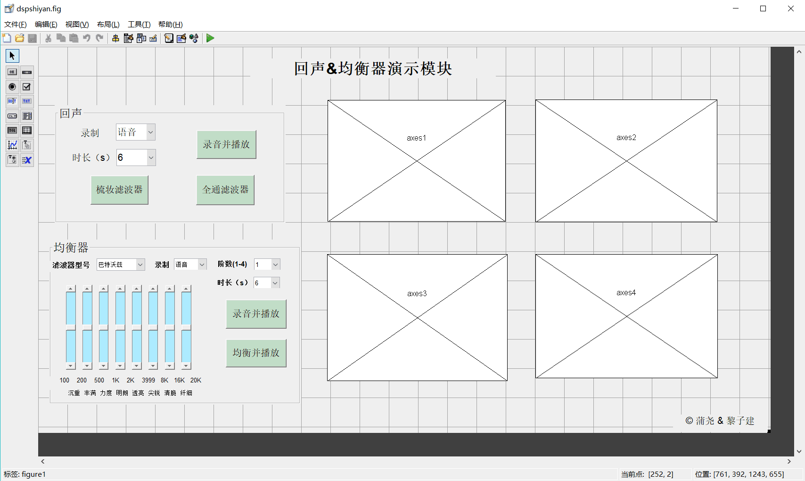
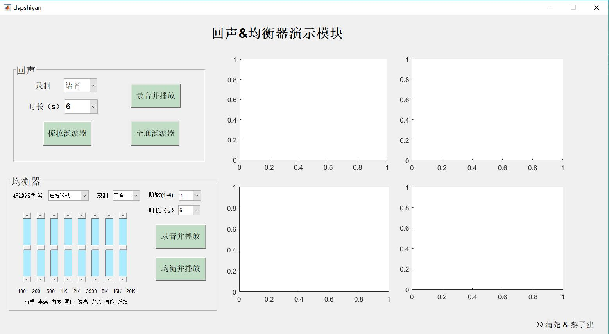
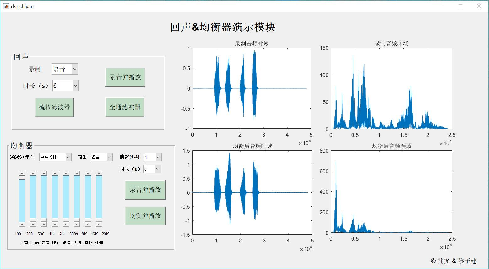

# 很菜的DSP课设
[](#contributors-)

## 一、我和子建同学主要做的是以下两个实验

- 3、  了解回声的产生和梳妆滤波器；
- 4、  混音效果的原理和均衡器的设计；

## 二、实验大致描述

### 1.文件结构
```
DSP-course-design
│
├─src
│   ├─dspshiyan.m
│   ├─record0.m
│   ├─dspshiyan.fig
│   └─test.wav
│
├─img
│   ├─guide可视化设计界面.png
│   ├─程序运行初始界面.jpg
│   └─程序运行界面.jpg
│
├─README.md
├─信工3班第6组DSP课设报告.pdf
├─信工3班第6组DSP课设报告.docx
└─a.wav
```
### 2.编程过程如下

- 打开matlab程序，新建一个.m文件
- 命令窗口输入guide即可打开可视化编辑界面
- 添加自己想要的控件
- 右击控件选择回调函数或者其他
- 编辑相应的代码

### 3.运行说明

- matlab打开src\dspshiyan.m按F5即可运行程序
- 回声方面有梳妆滤波器和全通滤波器两种制作回声的算法
- 均衡器直接调节相关按钮控制高低音，录音播放即可

## 三、简单几张效果图

**1.guide可视化设计界面**


**2.程序运行初始界面**


**3.程序运行界面**


## Contributors ✨

Thanks goes to these wonderful people ([emoji key](https://allcontributors.org/docs/en/emoji-key)):

<!-- ALL-CONTRIBUTORS-LIST:START - Do not remove or modify this section -->
<!-- prettier-ignore-start -->
<!-- markdownlint-disable -->
<table>
  <tr>
    <td align="center"><a href="https://Allenem.github.io"><br /><sub><b>蒲尧</b></sub></a><br /><a href="https://github.com/Allenem/DSP-course-design/commits?author=Allenem" title="Code">💻</a> <a href="https://github.com/Allenem/DSP-course-design/commits?author=Allenem" title="Documentation">📖</a></td>
  </tr>
</table>

<!-- markdownlint-enable -->
<!-- prettier-ignore-end -->
<!-- ALL-CONTRIBUTORS-LIST:END -->

This project follows the [all-contributors](https://github.com/all-contributors/all-contributors) specification. Contributions of any kind welcome!